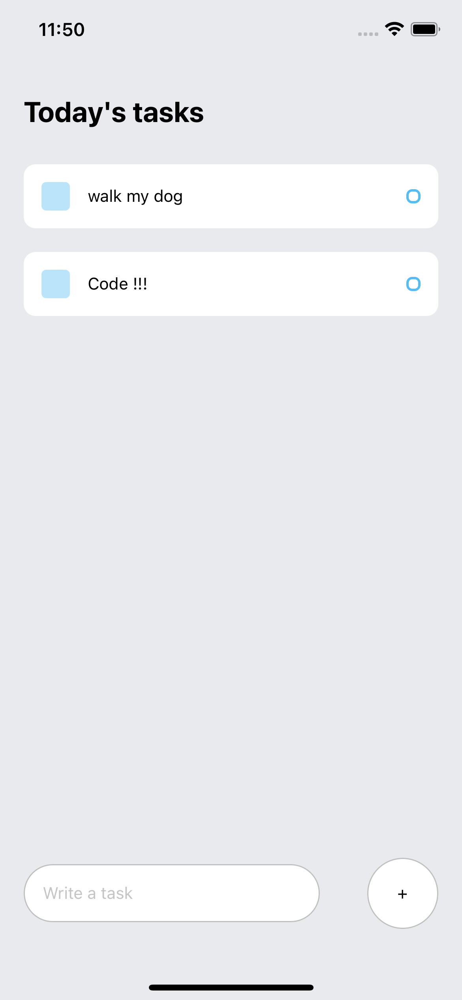

# to-do-app
### React Native Application



## 🚀 How to use

```sh
npm install --global expo-cli ("if you don't have Expo installed already")
```
```sh
expo init to-do-app
```
```sh
cd to-do-app
```
```sh
yarn start
```


## 📝 Notes
Tutorial I followed from @mattfrances
